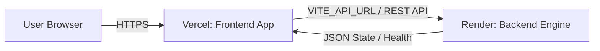

# 🚀 GreenCore AI — Production Deployment Guide

This guide details the step-by-step instructions to deploy **GreenCore AI**:
- **Backend API (Node.js/Express/TypeScript)** ➔ **[Render](https://render.com/)**
- **Frontend App (React/Vite/Tailwind CSS)** ➔ **[Vercel](https://vercel.com/)**

---

## 📌 Architecture Overview

---

## 1️⃣ Part 1: Deploy Backend to Render

### Option A: Using Render Blueprint (Recommended)
1. Push your repository to **GitHub** or **GitLab**.
2. Go to your [Render Dashboard](https://dashboard.render.com/).
3. Click **New +** ➔ **Blueprint**.
4. Connect your GreenCore repository.
5. Render will automatically detect the [`render.yaml`](./render.yaml) file at the root.
6. Click **Apply**. Render will automatically configure and build the backend.

### Option B: Manual Web Service Setup
1. Go to [Render Dashboard](https://dashboard.render.com/) ➔ Click **New +** ➔ **Web Service**.
2. Select your repository and configure the settings:
   - **Name**: `greencore-ai-backend` (or your choice)
   - **Language / Runtime**: `Node`
   - **Region**: `Oregon (US West)` or nearest region
   - **Branch**: `main`
   - **Root Directory**: `backend`
   - **Build Command**: `npm install && npm run build`
   - **Start Command**: `npm start`
   - **Plan Type**: `Free`
3. Add Environment Variables (under **Advanced** / **Environment Variables**):
   - `NODE_ENV`: `production`
   - `PORT`: `10000` (Render will bind to this automatically)
   - `ALLOWED_ORIGINS`: `*`
4. Click **Deploy Web Service**.

### 🧪 Verify Backend Deployment
Once deployed, Render will provide a public URL like:
`https://greencore-ai-backend.onrender.com`

Test the live endpoints in your browser or terminal:
- **Health check**: `https://<YOUR-RENDER-URL>/health`
- **Campus overview**: `https://<YOUR-RENDER-URL>/api/campus/overview`

---

## 2️⃣ Part 2: Deploy Frontend to Vercel

### Step-by-Step Vercel Setup
1. Go to [Vercel Dashboard](https://vercel.com/dashboard) and click **Add New...** ➔ **Project**.
2. Import your Git repository.
3. In the **Configure Project** screen:
   - **Project Name**: `greencore-ai` (or your choice)
   - **Framework Preset**: `Vite`
   - **Root Directory**: Click *Edit* and select **`frontend`**.
   - **Build & Output Settings**:
     - Build Command: `npm run build` *(default)*
     - Output Directory: `dist` *(default)*
     - Install Command: `npm install` *(default)*
4. **Environment Variables**:
   Add the following variable:
   - **Key**: `VITE_API_URL`
   - **Value**: `https://<YOUR-RENDER-URL>` *(e.g. `https://greencore-ai-backend.onrender.com` without trailing slash)*
5. Click **Deploy**.

> ℹ️ **Note on SPA Routing**: The project includes [`frontend/vercel.json`](./frontend/vercel.json) with client-side rewrites and caching headers to ensure all deep links reload properly.

---

## 3️⃣ Part 3: Connect & Test the Full Stack

1. Open your live Vercel URL (e.g., `https://greencore-ai.vercel.app`).
2. Look at the top navigation bar:
   - The **"REST Engine Online"** indicator will glow emerald green with a pulse badge when connected to your live Render backend.
3. **Execute the Killer Demo Flow**:
   - Click **"Auto Walkthrough"** or navigate to **Digital Twin 3D**.
   - Trigger **"Simulate Water Anomaly in Hostel B"** ➔ Watch live anomaly telemetry and audit logs.
   - Click **"Simulate Remediation"** ➔ Evaluate payback & CO₂ reduction.
   - Click **"Verify Closed-Loop Outcome"** ➔ Watch instantaneous score recovery and confetti celebration!
4. **Test AI Diagnostician**:
   - Ask questions like: *"Why did the Green Score drop?"* or *"What is our payback on solar retrofits?"*
   - Verify fast, contextual response streaming.

---

## ⚙️ Summary Configuration Matrix

| Platform | Component | Root Dir | Build Command | Start Command | Output Dir | Key Env Vars |
| :--- | :--- | :--- | :--- | :--- | :--- | :--- |
| **Render** | Backend API | `backend` | `npm install && npm run build` | `npm start` | `dist` | `NODE_ENV=production`, `PORT=10000` |
| **Vercel** | Frontend Web | `frontend` | `npm run build` | — | `dist` | `VITE_API_URL=https://<your-render-url>` |

---

## 💡 Troubleshooting & Tips

- **Render Cold Starts**: On Render's Free tier, the service spins down after 15 minutes of inactivity and may take 20–30 seconds on initial wake-up. The GreenCore frontend features resilient fallback data and automatically detects when the backend comes online.
- **CORS Configuration**: The backend has open CORS configured by default (`cors({ origin: '*' })`), allowing smooth communication from your Vercel domain.
